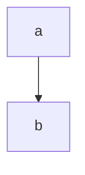

import Tabs from '@theme/Tabs';
import TabItem from '@theme/TabItem';

# `print()` Fonksiyonu

Normalde önceki kısımlarda bu fonksiyonu az biraz görsek de artık bu fonksiyonu gerçekten tanımakta faydalar var. Çünkü her zaman verilerimiz çok basit formlarda veya görevimiz ekrana direkt olarak sabit bir yazı yazdırmak olmayacak. Bunun için elimizdeki bu eşsiz fonksiyonu gerçekten tanımamız lazım.

Normal şartlarda kullandığımız IDLE direkt olarak değişkenlerimizi bize göstermişti. Bu ufak denemelerde ideal ancak yeri gelince kaynak kodlar için dosya açıp bu dosyalardan kullanıcının terminaline bazı çıktılar göndermemiz gerekecek. İşte bunun için `print()` fonksiyonu kullanıyoruz. Python'da print yazımının ne kadar kolay olduğuna bir bakalım

<Tabs>
  <TabItem value="py" label="Python" default>

```python
print("Hello World")
```

  </TabItem>
  <TabItem value="cpp" label="C++">

```cpp
#include <iostream>

int main(){
  std::cout << "Hello World" << std::endl;

  return 0;
}
```
  </TabItem>
</Tabs>



